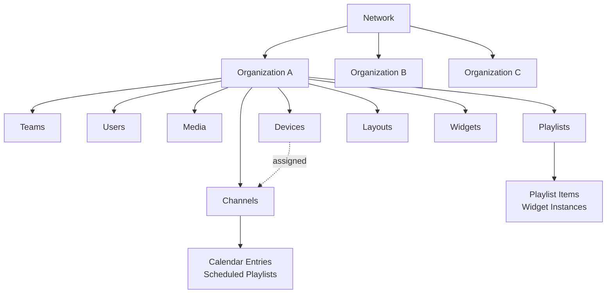
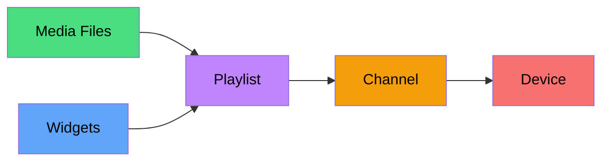
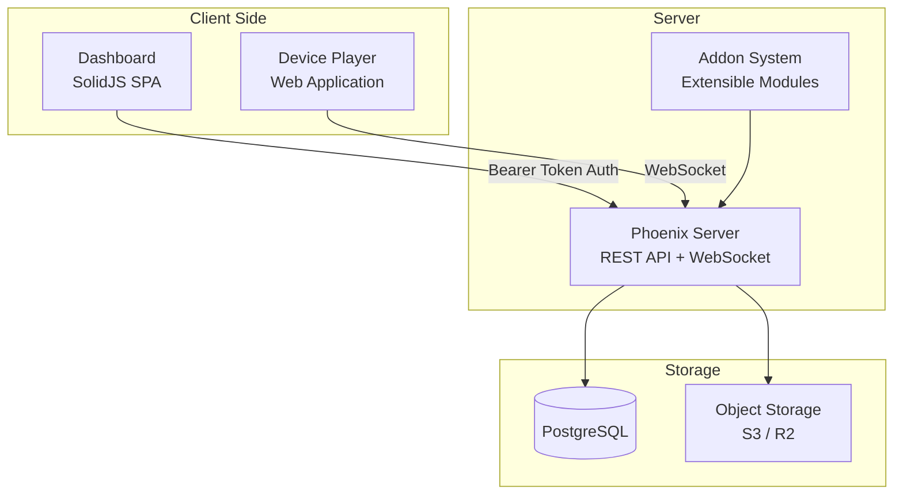

# Architecture

Castmill is a multi-tenant digital signage platform built around a clear hierarchy of resources. Understanding this hierarchy is key to using the system effectively.

## The Resource Hierarchy



### Network

The **network** is the top-level boundary. Each network:

- Is tied to a **domain** (e.g., `signage.company.com`)
- Acts as a **complete data silo** — no data crosses network boundaries
- Has its own set of organizations, users, and configuration
- Can be managed by network administrators

Most deployments use a single network. Multiple networks are used when you need fully isolated environments (e.g., different clients on a SaaS platform).

→ [Learn more about Networks](./networks.md)

### Organization

**Organizations** are the working spaces within a network. Each organization:

- Contains all content resources (media, playlists, channels, devices, layouts, widgets)
- Has its own **users and teams** with role-based permissions
- Has a **plan** that determines quotas (how many devices, media files, etc.)
- Operates independently from other organizations in the same network

Users can belong to multiple organizations and switch between them in the dashboard.

→ [Learn more about Organizations](./organizations.md)

### Resources

Within an organization, the main resources are:

| Resource      | Purpose                                                        |
| ------------- | -------------------------------------------------------------- |
| **Media**     | Images and videos uploaded for use in playlists                |
| **Playlists** | Ordered sequences of widgets with content and timing           |
| **Channels**  | Time-based schedules that assign playlists to time slots       |
| **Devices**   | Physical display screens registered to the organization        |
| **Layouts**   | Multi-zone screen arrangements for complex displays            |
| **Widgets**   | Reusable content components (image, video, weather, web, etc.) |
| **Teams**     | Groups of users with shared permissions                        |

## Content Flow

Understanding how content reaches a display device:



1. **Upload media** — Images, videos, and other files are uploaded to the organization
2. **Build playlists** — Combine media and widgets into ordered playlists with timing
3. **Schedule channels** — Assign playlists to time slots on a weekly calendar
4. **Assign to devices** — Connect channels to physical display devices
5. **Devices play content** — Devices pull their schedule and play the right content at the right time

## System Components



### Dashboard

The management interface is a **SolidJS single-page application**. It communicates with the server via REST API calls authenticated with Bearer tokens. The dashboard supports 9 languages and uses passkey-based authentication.

### Server

The **Elixir/Phoenix server** handles all business logic, authentication, asset management, and real-time communication with devices via WebSocket channels.

### Addon System

Castmill features a modular **addon system**. Core features (playlists, media, devices, channels, layouts, widgets) are implemented as addons, and the system is extensible with third-party addons for billing, custom domains, and other features.

### Player

The **device player** is a web application that runs on display devices. It connects to the server via WebSocket, receives its schedule and content, caches media locally, and renders playlists on screen.

## Multi-Tenancy Model

Castmill uses a network-based multi-tenancy model:

```
┌─────────────────────────────────────────┐
│              Castmill Instance           │
│                                         │
│  ┌─────────────┐  ┌─────────────┐      │
│  │  Network A   │  │  Network B   │      │
│  │ company.com  │  │ agency.com   │      │
│  │             │  │             │      │
│  │  Org 1      │  │  Org X      │      │
│  │  Org 2      │  │  Org Y      │      │
│  │  Org 3      │  │             │      │
│  └─────────────┘  └─────────────┘      │
│                                         │
│  Data is completely isolated between    │
│  networks. Organizations within a       │
│  network share nothing by default.      │
└─────────────────────────────────────────┘
```

Each network resolves from a domain. When you access `company.com`, the server identifies the corresponding network and scopes all operations to it.
