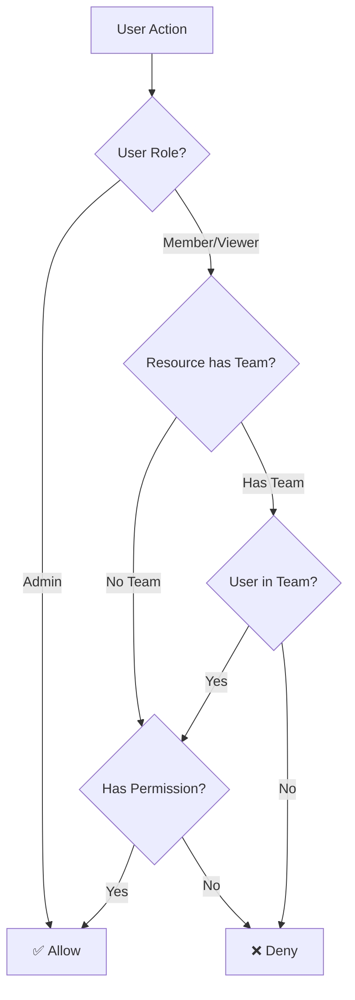

# Users & Teams

Castmill provides fine-grained access control through users, roles, and teams.

## Users

### Roles

Every user within an organization has a role:

| Role       | Description                                                                     |
| ---------- | ------------------------------------------------------------------------------- |
| **Admin**  | Full control over the organization: manage members, settings, and all resources |
| **Member** | Create and manage content and devices within allowed teams                      |
| **Viewer** | Read-only access to the organization's resources                                |

Admins can invite new users, change roles, and remove members from the organization.

### Inviting Users

To invite a user to your organization:

1. Navigate to **Organization** in the sidebar
2. Open the **Invitations** tab
3. Click **Invite User**
4. Enter their email address and select a role
5. Send the invitation

<!-- TODO: Screenshot — Invitation form with email and role fields -->

The invited user receives an email with a link to join. If they don't have a Castmill account yet, they'll create one during the signup process.

### Blocking Users

Network administrators can **block** users at the network level, preventing them from logging in. Organization admins can remove users from their specific organization.

## Teams

**Teams** are groups of users within an organization. They serve two purposes:

1. **Collaboration** — Group users who work together
2. **Access control** — Restrict which resources (media, playlists, devices, etc.) a user can see and manage

### How Team-Based Permissions Work

Resources (media, playlists, channels, devices, layouts) can be **assigned to teams**. When a resource is assigned to a team:

- Only **team members** and **organization admins** can access it
- Resources without a team assignment are visible to all organization members

This enables scenarios like:

- A "Lobby Displays" team manages only lobby-related content and devices
- A "Marketing" team manages only marketing playlists
- Organization admins can see and manage everything regardless of team assignments

### Creating a Team

1. Navigate to **Teams** in the sidebar
2. Click **Add Team**
3. Enter a name for the team
4. Add members to the team

<!-- TODO: Screenshot — Teams page showing team list -->

### Assigning Resources to Teams

Most resource creation forms include an optional **Team** field. You can also filter resources by team in any list view using the team filter dropdown.

<!-- TODO: Screenshot — Team filter dropdown on a resource list -->

## Permissions Matrix

The permission system checks capabilities at multiple levels:

Available permissions per resource type:

| Permission | Description                        |
| ---------- | ---------------------------------- |
| **Create** | Create new instances of a resource |
| **Read**   | View resource details              |
| **Update** | Modify existing resources          |
| **Delete** | Remove resources                   |
| **List**   | See resources in list views        |
