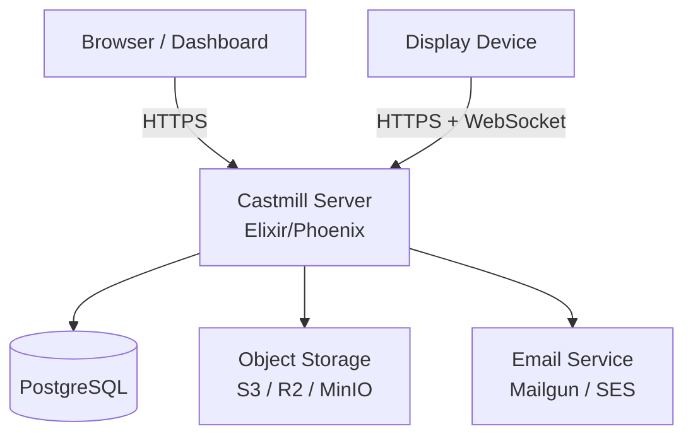

# Self-Hosting Guide

Castmill can be self-hosted on any infrastructure that supports Docker or Elixir/Phoenix applications. This guide covers a production-ready setup.

## Architecture Overview

A Castmill deployment consists of:



| Component           | Purpose                                     | Required? |
| ------------------- | ------------------------------------------- | --------- |
| **Castmill Server** | API, authentication, WebSocket connections  | Yes       |
| **PostgreSQL**      | Data storage (users, orgs, playlists, etc.) | Yes       |
| **Object Storage**  | Media file storage (images, videos)         | Yes       |
| **Email Service**   | Signup verification, invitations, recovery  | Yes       |
| **Redis**           | Background job processing (optional)        | Optional  |

## Docker Deployment

### Production Docker Compose

Create a `docker-compose.yml` for production:

```yaml
version: '3.8'

services:
  castmill:
    image: ghcr.io/castmill/castmill:latest
    ports:
      - '4000:4000'
    environment:
      - DATABASE_URL=ecto://castmill:password@db/castmill
      - SECRET_KEY_BASE=your-64-char-secret-key
      - PHX_HOST=your-domain.com
      - PORT=4000
      # See Environment Variables section below
    depends_on:
      db:
        condition: service_healthy

  db:
    image: postgres:16-alpine
    environment:
      POSTGRES_USER: castmill
      POSTGRES_PASSWORD: password
      POSTGRES_DB: castmill
    volumes:
      - pgdata:/var/lib/postgresql/data
    healthcheck:
      test: ['CMD-SHELL', 'pg_isready -U castmill']
      interval: 10s
      timeout: 5s
      retries: 5

volumes:
  pgdata:
```

### Generate a Secret Key

```bash
mix phx.gen.secret
```

Or use OpenSSL:

```bash
openssl rand -base64 48
```

## Object Storage Setup

Castmill stores uploaded media in S3-compatible object storage. You can use:

- **AWS S3** — Standard cloud storage
- **Cloudflare R2** — Zero egress fees (recommended for signage)
- **MinIO** — Self-hosted, S3-compatible

### MinIO (Local Development)

```bash
docker run -p 9000:9000 -p 9001:9001 \
  -e "MINIO_ROOT_USER=minioadmin" \
  -e "MINIO_ROOT_PASSWORD=minioadmin" \
  -v ~/minio/data:/data \
  quay.io/minio/minio server /data --console-address ":9001"
```

Create a bucket named `castmill-media` through the MinIO console at `http://localhost:9001`.

### Configuration

Set these environment variables for your storage backend:

```bash
# AWS S3
AWS_ACCESS_KEY_ID=your-key
AWS_SECRET_ACCESS_KEY=your-secret
AWS_S3_BUCKET=castmill-media
AWS_REGION=eu-north-1

# For Cloudflare R2 or MinIO, also set:
AWS_S3_HOST=your-endpoint.r2.cloudflarestorage.com  # R2
# AWS_S3_HOST=localhost                              # MinIO
# AWS_S3_PORT=9000                                   # MinIO
# AWS_S3_SCHEME=http://                              # MinIO (no TLS)
```

## Email Configuration

Castmill requires email for signup verification, invitations, and credential recovery. Configure one of:

### Mailgun

```bash
MAILGUN_API_KEY=your-api-key
MAILGUN_DOMAIN=mail.your-domain.com
MAIL_FROM=noreply@your-domain.com
```

### SMTP (Generic)

```bash
SMTP_HOST=smtp.your-provider.com
SMTP_PORT=587
SMTP_USERNAME=your-username
SMTP_PASSWORD=your-password
MAIL_FROM=noreply@your-domain.com
```

## Environment Variables Reference

| Variable                | Required | Default     | Description                            |
| ----------------------- | -------- | ----------- | -------------------------------------- |
| `DATABASE_URL`          | Yes      | —           | PostgreSQL connection string           |
| `SECRET_KEY_BASE`       | Yes      | —           | Phoenix secret (min 64 chars)          |
| `PHX_HOST`              | Yes      | `localhost` | Public hostname                        |
| `PORT`                  | No       | `4000`      | HTTP port                              |
| `POOL_SIZE`             | No       | `10`        | Database connection pool size          |
| `AWS_ACCESS_KEY_ID`     | Yes      | —           | S3 access key                          |
| `AWS_SECRET_ACCESS_KEY` | Yes      | —           | S3 secret key                          |
| `AWS_S3_BUCKET`         | Yes      | —           | S3 bucket name                         |
| `AWS_REGION`            | No       | `us-east-1` | S3 region                              |
| `AWS_S3_HOST`           | No       | —           | Custom S3 endpoint (R2/MinIO)          |
| `MAILGUN_API_KEY`       | Cond.    | —           | Mailgun API key                        |
| `MAILGUN_DOMAIN`        | Cond.    | —           | Mailgun sending domain                 |
| `MAIL_FROM`             | Yes      | —           | Sender email address                   |
| `REDIS_URL`             | No       | —           | Redis connection (for background jobs) |

## Database Setup

On first run, Castmill automatically runs migrations. To run them manually:

```bash
# Inside the Docker container
/app/bin/castmill_saas eval "CastmillSaas.Release.migrate()"

# Or for the OSS version
mix ecto.migrate
```

### Seeding

To create the initial admin user and set up default data:

```bash
mix run priv/repo/seeds.exs
```

## Reverse Proxy

For production, place Castmill behind a reverse proxy (Nginx, Caddy, or Cloudflare) for TLS termination:

### Nginx Example

```nginx
server {
    listen 443 ssl;
    server_name your-domain.com;

    ssl_certificate /path/to/cert.pem;
    ssl_certificate_key /path/to/key.pem;

    location / {
        proxy_pass http://127.0.0.1:4000;
        proxy_set_header Host $host;
        proxy_set_header X-Real-IP $remote_addr;
        proxy_set_header X-Forwarded-For $proxy_add_x_forwarded_for;
        proxy_set_header X-Forwarded-Proto $scheme;

        # WebSocket support (required for device connections)
        proxy_http_version 1.1;
        proxy_set_header Upgrade $http_upgrade;
        proxy_set_header Connection "upgrade";
    }
}
```

:::important
WebSocket support is required. Devices maintain persistent WebSocket connections to the server for real-time updates.
:::

## Health Check

The server exposes a health endpoint:

```bash
curl http://localhost:4000/api/health
```

Returns `200 OK` when the server is ready.
