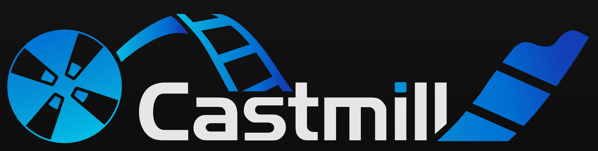

# Introduction



Welcome to **Castmill**, a comprehensive open-source platform for creating and managing digital signage. Castmill provides content management, device management, scheduling, and APIs for third-party integrations and extensions.

## What is Castmill?

Castmill helps you manage digital displays at any scale — from a single screen in a lobby to thousands of devices across multiple locations. The platform is built around a few core concepts:

- **[Networks](concepts/networks.md)** — Isolated environments with their own domains, organizations, and data
- **[Organizations](concepts/organizations.md)** — Workspaces where teams collaborate on content and devices
- **[Playlists](dashboard/playlists.md)** — Ordered sequences of widgets (images, videos, tickers, web pages)
- **[Channels](dashboard/channels.md)** — Weekly schedules that determine when playlists play
- **[Devices](dashboard/devices.md)** — Physical screens that display your content
- **[Layouts](dashboard/layouts.md)** — Multi-zone screen arrangements for complex displays

## Quick Start

The fastest way to try Castmill is with Docker Compose — you can have a running instance in under 5 minutes:

```bash
git clone https://github.com/castmill/castmill.git
cd castmill
docker-compose up
```

See the [Quick Start guide](getting-started/quick-start.md) for full details.

## Documentation Guide

### For Users

| Section                                           | What You'll Learn                               |
| ------------------------------------------------- | ----------------------------------------------- |
| [Getting Started](getting-started/quick-start.md) | Install and run Castmill                        |
| [First Login](getting-started/first-login.md)     | Sign up, create your account, register a device |
| [Dashboard](dashboard/overview.md)                | Navigate the management interface               |
| [Playlists](dashboard/playlists.md)               | Create and edit content sequences               |
| [Channels](dashboard/channels.md)                 | Schedule content on a weekly calendar           |
| [Devices](dashboard/devices.md)                   | Register and manage display screens             |

### For Administrators

| Section                                         | What You'll Learn                        |
| ----------------------------------------------- | ---------------------------------------- |
| [Self-Hosting](getting-started/self-hosting.md) | Deploy Castmill in production            |
| [Architecture](concepts/architecture.md)        | Understand the system design             |
| [Networks](concepts/networks.md)                | Domain-based isolation and multi-tenancy |
| [Authentication](concepts/authentication.md)    | Passkey-based security model             |
| [Users & Teams](concepts/users-and-teams.md)    | Roles, permissions, and access control   |

### For Developers

| Section                        | What You'll Learn                           |
| ------------------------------ | ------------------------------------------- |
| [Widgets](widgets/widgets.mdx) | Build custom widget types                   |
| [Addons](addons/addons.md)     | Extend the platform with server + UI addons |
| [Player](player/player.md)     | Embed the player in custom applications     |

## Local Development

For contributing to Castmill or running from source, see the [Self-Hosting guide](getting-started/self-hosting.md) for prerequisites and setup instructions.

### Prerequisites

- [Elixir](https://elixir-lang.org/install.html) 1.17+
- [Node.js](https://nodejs.org/) 18+
- [PostgreSQL](https://www.postgresql.org/) 15+

### Quick Setup

```bash
# Clone and install
git clone https://github.com/castmill/castmill.git
cd castmill/packages/castmill

# Database setup
mix deps.get
mix ecto.setup

# Start the server
mix phx.server
```

Then start the dashboard:

```bash
cd packages/dashboard
yarn install
yarn dev
```

- **Admin tool**: http://localhost:4000/admin (default: `root@example.com` / `root`)
- **Dashboard**: http://localhost:3000
- **Player**: http://localhost:4000

:::important
When creating a network in the admin tool, set the **Domain** to `localhost:3000` (including the port). The server uses this domain for CORS — if it doesn't match the dashboard's origin exactly, API calls will fail.
:::
